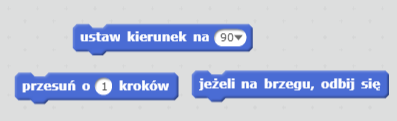
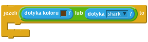

--- challenge ---

## Wyzwanie: więcej przeszkód!

Potrafisz dodać więcej przeszkód do Twojej gry? Oto kilka pomysłów:

--- task ---

Możesz dodać wodorosty do tła sceny i zmienić grę tak, aby wodorosty spowolniały łódź kiedy ich dotknie.

--- hints --- --- hint --- Możesz użyć bloku `czekaj`, aby osiągnąć ten efekt:  --- /hint --- --- /hints ---

--- /task ---

--- task ---

Możesz dodać poruszające się obiekty takie jak rekiny lub kłody!

--- hints --- --- hint --- Te bloki kodu mogą być pomocne, aby poruszyć nowy obiekt:

Jeśli dodana przez ciebie przeszkoda nie jest brązowa, będziesz musiał dodać taki kod dla łodzi:

 --- /hint --- --- /hints ---

--- /task ---

--- /challenge ---