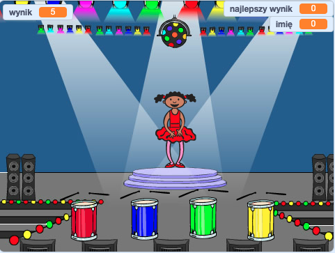

## Co dalej?

Gratulujemy ukończenia projektu „Wyścig łodzi”! Czy chciałbyś spróbować czegoś nieco trudniejszego?

Możesz wypróbować projekt [Pamięć](https://projects.raspberrypi.org/en/projects/memory?utm_source=pathway&utm_medium=whatnext&utm_campaign=projects).

\--- no-print \---

Kliknij na zieloną flagę, aby rozpocząć. Obserwuj sekwencję kolorów zaprezentowaną przez sukienkę tancerki i wysłuchaj towarzyszących rytmów bębna. Następnie powtórz zaprezentowane kolory. Jeśli źle podasz kolejność kolorów, gra się kończy!

  <iframe allowtransparency="true" width="485" height="402" src="//scratch.mit.edu/projects/embed/284452634/?autostart=false" frameborder="0" allowfullscreen scrolling="no"></iframe> 

\--- /no-print \---

\--- print-only \---

\--- /print-only \---