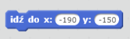

--- challenge ---

## Wyzwanie: więcej łodzi!

Potrafisz zrobić ze swojej gry grę dla dwóch graczy? Drugi gracz będzie musiał sterować łodzią wykorzystując na klawiaturze strzałkę w górę, aby płynąć do przodu oraz prawą i lewą aby skręcać.

--- hints --- --- hint --- Powiel łódź i zmień kolor łódź2.

 --- /hint --- --- hint --- Spraw, aby dwie łodzie startowały w innych miejscach zmieniając ten kod:

 --- /hint --- --- hint --- Usuń kod łodzi2 odpowiedzialny za sterowanie za pomocą myszki i zamień go na kod, dzięki któremu będziesz sterował strzałkami na klawiaturze. --- /hint --- --- hint --- Oto kod, którego będziesz potrzebował, aby łódź2 poruszała się naprzód:

 --- /hint --- --- hint --- Potrzebujesz także kodu do *obracania* łodzi, kiedy strzałka w lewo lub prawo jest wciśnięta. --- /hint --- --- /hints ---

--- /challenge ---