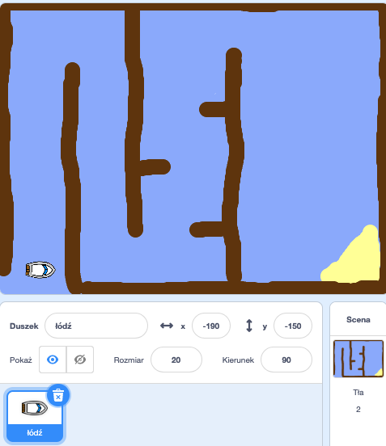

## Zaczynamy

--- task ---

Otwórz projekt startowy.

--- collapse ---
title: Używam Scratch online
image: images/image.png
---

Otwórz projekt startowy "Wyścig łódek" klikając na [jumpto.cc/boat-go](https://scratch.mit.edu/projects/228576599/#editor){:target="_blank"}

--- collapse ---
---
title: Używam Scratch offline
image: images/image.png
---

Pobierz projekt startowy Scratch "Wyścig łódek" z [jumpto.cc/boat-get](resources/BoatRaceResources.sb2){:download="BoatRaceResources.sb2"}, a następnie otwórz go za pomocą edytora offline. --- /collapse ---

--- /task ---

--- task ---

Projekt zawiera dzuszka łodzi i tło z torem, na którym jest:

- Drewno, które twoja łódź musi omijać
- Bezludna wyspa, do której twoja łódź musi dotrzeć
    
    

--- /task ---