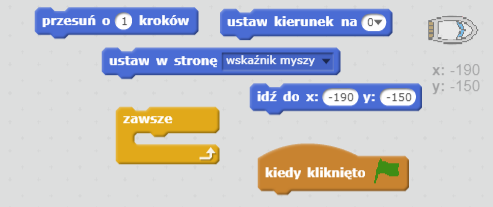
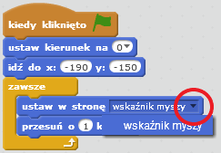
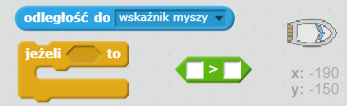
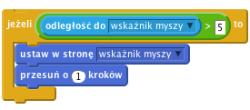

## Sterowanie łodzią

\--- task \---

Będziesz sterować łodzią za pomocą swojej myszki. Dodaj kod do swojej łodzi tak, aby startowała z dolnego lewego narożnika i była skierowana do góry, a następnie, aby podążała za wskaźnikiem myszy. **Sprawdź swój kod**, aby upewnić się, że robi to, co powinien.

\--- hints \--- \--- hint \--- `Kiedy kliknięto zieloną flagę` musisz doprowadzić łódź `do pozycji początkowej` i `ustawić kierunek na górę`. Następnie łódź musi się `ustawić w stronę wskaźnika myszki` i `przesunąć o 1 krok`. Musi to powtarzać cały czas `zawsze`.

\--- /hint \--- \--- hint \--- Oto bloki kodu, których będziesz potrzebować:  \--- /hint \--- \--- hint \--- Tak powinien wyglądać twój kod:  \--- /hint \--- \--- /hints \---

\--- /task \---

\--- task \---

Przetestuj swoją łódź poprzez kliknięcie flagi i poruszenie myszki. Czy łódź płynie w jej kierunku?

## \--- collapse \---

title: Jeśli masz problemy...

## image: images/image.png

**Informacja:** Obecnie w Scratchu występuje błąd, który może powodować, że twoja łódź nie będzie ruszać się w kierunku wskaźnika myszy. Jeśli tak się stanie, kliknij strzałkę w bloku `ustaw w stronę` i ponownie wybierz `wskaźnik myszy`.

 \--- /collapse \---

\--- /task \---

\--- task \---

Co się stanie jeśli łódź dotrze do wskaźnika myszy? Spróbuj.

\--- /task \---

\--- task \---

Aby to się nie zdarzało, musisz dodać do swojego kodu blok warunku `jeżeli` tak, aby łódź poruszała się tylko jeśli jest w odległości nie większej niż 5 pikseli od myszy.

\--- hints \--- \--- hint \--- Łódź powinna wskazywać tylko na wskaźnik myszy i poruszać się `jeżeli` `odległość od wskaźnika myszy` jest `większa niż 5 pikseli`. \--- /hint \--- \--- hint \--- Oto bloki, które musisz dodać do kodu łodzi:  \--- /hint \--- \--- hint \--- Tak powinien wyglądać twój kod:  \--- /hint \--- \--- /hints \---

\--- /task \---

\--- task \---

Jeszcze raz przetestuj swoją łódź, aby sprawdzić, czy problem został rozwiązany.

\--- /task \---