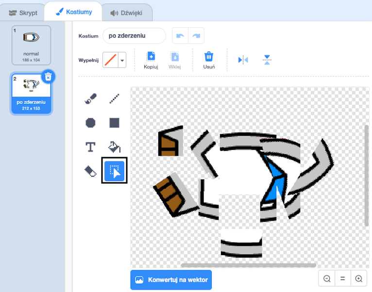

## Zderzenia!

W tej chwili duszek łodzi może po prostu żeglować przez drewniane bariery! Naprawisz to teraz.

\--- task \---

Potrzebujesz dwa kostiumy dla duszka łodzi: jeden normalny kostium i jeden na wypadek uderzenia łodzi. Zduplikuj kostium duszka łodzi i nazwij jeden kostium „normalny”, a drugi „po uderzeniu”.

\--- /task \---

\--- task \---

Kliknij kostium „po uderzeniu” i użyj narzędzia **Wybierz**, aby chwycić części kostiumu, przesuwać je i obracać, aby łódź wyglądała, jakby się rozbiła.



\--- /task \---

\--- task \---

Teraz dodaj kod do swojej łodzi, aby rozbiła się i rozpadła, gdy dotknie jakiejkolwiek brązowej drewnianej bariery.

\--- wskazówki \--- \--- wskazówka \--- Musisz dodać bloki kodu do swojej pętli `zawsze`{:class="block3control"}, aby Twój kod sprawdzał, czy duszek łodzi się rozbił, i jeśli się rozbił, kod musi zresetować pozycję duszka łodzi.

`jeżeli`{:class="block3control"} łódź `dotyka`{:class="block3sensing"} brązowy kolor drewna, musisz `przełączyć na kostium "po uderzeniu"`{:class="block3looks"}, `powiedz Nieee! przez 2 sekundy`{:class="block3looks"}, a następnie `przełącz się z powrotem na kostium "normalny"`{:class="block3looks"}. Na koniec musisz `punktów w górę`{: class = "block3motion"} i `przejść do pozycji początkowej`{: class = "block3motion"}.

\--- /hint \--- \--- hint \--- Oto potrzebne bloki kodu: 

```blocks3
jeśli <touching color [ ] ?> to
koniec

przejdź do x: (-190) y: (-150)

zmień kostium na (hit v)

punkt w kierunku (0)

przełącz kostium na (normalne v)

powiedz [Noooooo!] dla (2 sekundy
```

\--- / wskazówka \--- \--- wskazówka \--- Oto jak powinien wyglądać twój kod: 

```blocks3
po kliknięciu flagi
punkt w kierunku (0)
przejdź do x: (-190) y: (-150)
zawsze
jeśli <(odległość do (wskaźnik myszy v)) > [5]> a następnie
punktów w kierunku (mysz- wskaźnik v)
ruch (1) kroki
koniec
jeśli <touching color [#663b00] ?> a następnie
zmień kostium na (hit v)
powiedz [Noooooo!] na (2) sekundy
przełącz kostium na (normalne v)
punktów w kierunku (0)
idź do x: (-190) y: (-150)
koniec
```

\--- /hint \--- \--- /hints \---

\--- /task \---

\--- task \---

Powinieneś także dodać kod, aby upewnić się, że twój duszek zawsze zaczyna wyglądać „normalnie”.

Sprawdź swój kod ponownie. Jeśli teraz spróbujesz przepłynąć łódź przez drewnianą barierę, łódź powinna się rozbić, a następnie powrócić do pozycji wyjściowej.


\--- /task \---