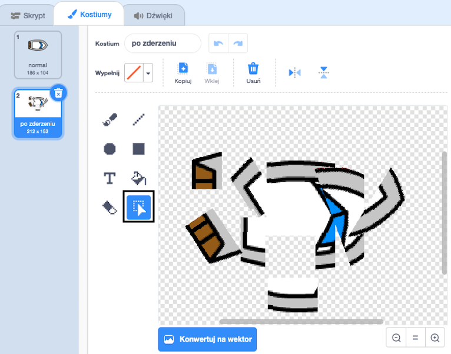

## Zderzenia!

W tej chwili duszek łodzi może po prostu żeglować przez drewniane bariery! Teraz to naprawisz.

--- task ---

Potrzebujesz dwa kostiumy dla duszka łodzi: jeden normalny kostium i jeden na wypadek uderzenia łodzi. Zduplikuj kostium duszka łodzi i nazwij jeden kostium „normalny”, a drugi „po uderzeniu”.

--- /task ---

--- task ---

Kliknij kostium „po uderzeniu” i użyj narzędzia **Wybierz**, aby chwycić części kostiumu, przesuwać je i obracać, aby łódź wyglądała, jakby się rozbiła.



--- /task ---

--- task ---

Teraz dodaj kod do swojej łodzi, aby rozbiła się i rozpadła, gdy dotknie jakiejkolwiek brązowej drewnianej bariery.

--- hints ---
 --- hint --- Musisz dodać bloki kodu do swojej pętli `zawsze`{:class="block3control"}, aby Twój kod sprawdzał, czy duszek łodzi się rozbił, i jeśli się rozbił, kod musi zresetować pozycję duszka łodzi.

`jeżeli`{:class="block3control"} łódź `dotyka`{:class="block3sensing"} brązowy kolor drewna, musisz `przełączyć na kostium "po uderzeniu"`{:class="block3looks"}, `powiedz Nieee! przez 2 sekundy`{:class="block3looks"}, a następnie `przełącz się z powrotem na kostium "normalny"`{:class="block3looks"}. Na koniec musisz `skierować w górę`{:class="block3motion"} i `przejść do pozycji początkowej`{:class="block3motion"}.

--- /hint --- --- hint ---
Oto potrzebne bloki kodu:


```blocks3
if <touching color [kolor] ?> then
end

go to x: (-190) y: (-150)

switch costume to (po uderzeniu v)

point in direction (0)

switch costume to (normalny v)

say [Nieeee!] for (2) seconds
```

--- /hint --- --- hint ---

Oto jak powinien wyglądać twój kod:


```blocks3
when flag clicked
point in direction (0)
go to x: (-190) y: (-150)
forever 
  if <(distance to (wskaźnik myszy v)) > [5]> then 
    point towards (wskaźnik myszy v)
    move (1) steps
  end
  if <touching color [#663b00] ?> then 
    switch costume to (po uderzeniu v)
    say [Nieeee!] for (2) seconds
    switch costume to (normalny v)
    point in direction (0)
    go to x: (-190) y: (-150)
  end
end
```

--- /hint --- --- /hints ---

--- /task ---

--- task ---

Powinieneś także dodać kod, aby upewnić się, że twój duszek zawsze rozpoczyna z wyglądem „normalny”.

Sprawdź swój kod ponownie. Jeśli teraz spróbujesz przepłynąć łodzią przez drewnianą barierę, łódź powinna się rozbić, a następnie powrócić do pozycji wyjściowej.


--- /task ---