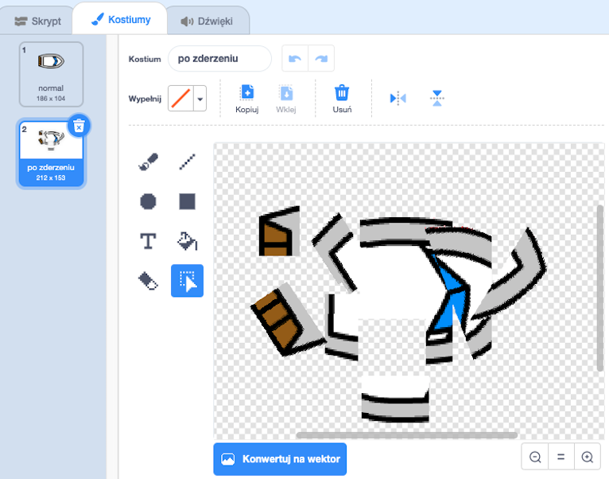
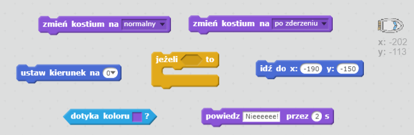
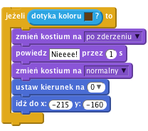

## Zderzenia!

W tym momencie twoja łódź może przepływać przez drewniane bariery! Naprawmy to.

--- task ---

Będziesz potrzebować dwóch kostiumów dla łodzi: jeden standardowy i jeden dla łodzi po uderzeniu w przeszkodę. Powiel obecny kostium duszka-łodzi i nazwij pierwszy z nich "normalny" a drugi "po zderzeniu".

--- /task ---

--- task ---

Kliknij na kostium "po zderzeniu" i wybierz narzędzie "Wybierz". Zaznacz kawałki kostiumu i poobracaj je tak, aby twoja łódź wyglądała na zniszczoną.

--- /task ---

--- task ---

Dodaj poniższy kod dla łodzi, aby łódź wyglądała na zniszczoną, kiedy dotknie brązowego koloru.

--- hints --- --- hint --- Musisz dodać kod wewnątrz bloku `zawsze`, aby kod ciągle sprawdzał, czy łódź się rozbiła. `Jeżeli` łódź `dotyka` brązowego koloru drewna, musisz `zmienić kostium na "po zderzeniu"` i `powiedz Nieeeee! przez 2 sekundy`, a następnie `wrócić do normalnego stroju`. Na koniec musisz łódź `ustawić do góry` i `przejść do pozycji startowej`. --- /hint --- --- hint --- Oto bloki kodu, których będziesz potrzebować:  --- /hint --- --- hint --- Tak powinien wyglądać twój kod:  --- /hint --- --- /hints ---

--- /task ---

--- task ---

Upewnij się też, że kostium "normalny" jest wybrany po rozpoczęciu gry.

Teraz jeżeli spróbujesz wpłynąć na kłodę, łódź powinna ulec zniszczeniu i wrócić na pozycję startową.

--- /task ---