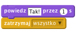

## Wyzwanie: zwycięstwo!

Czy potrafisz dodać kolejny blok `jeżeli` do Twojego kodu, aby gracz wygrywał kiedy dotknie piaszczystej wyspy?

Kiedy łódź dotrze do wyspy, gra powinna wykrzyknąć "TAK!" i zatrzymać się.

--- hints --- --- hint --- Musisz jeszcze dodać kod w swojej pętli `zawsze`, aby twój kod sprawdzał, czy gracz wygrał. `Jeżeli` łódź `dotyka` koloru wyspy skarbów, musisz `powiedzieć "TAK!" przez 2 sekundy` i `zatrzymać wszystko`, aby zakończyć grę. --- /hint --- --- hint --- Oto bloki kodu, których będziesz potrzebować:  --- /hint --- --- hint --- Tak powinien wyglądać twój kod: 

Nie zapominaj, że nowy kod musi znajdować się w twojej pętli `zawsze`. --- /hint --- --- /hints ---