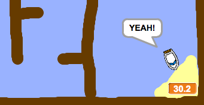

## Dodawanie stopera

Teraz dodasz stoper do swojej gry, aby gracz musiał dotrzeć na wyspę najszybciej jak to możliwe.

--- task ---

Dodaj nową zmienną o nazwie `czas`{:class="block3variables"} do swojej Sceny.


[[[generic-scratch3-add-variable]]]

Możesz także wybrać wygląd stopera, zmieniając sposób wyświetlania nowej zmiennej.

--- /task ---

--- task ---

Teraz dodaj bloki kodu do swojej Sceny, aby stoper odliczał czas, aż łódź dotrze na wyspę.

--- hints ---
 --- hint --- Na scenie, `kiedy kliknięto zieloną flagę`{:class="block3control"}, `ustaw czas na 0`{:class="block3variables"}. Wewnątrz pętli `zawsze`{:class="block3control"} musisz najpierw `czekać 0.1 sekund`{:class="block3control"}, a następnie `zmienić czas o 0.1`{:class="block3variables"}.
--- /hint ---
 --- hint --- Oto bloki kodu, których potrzebujesz: 

```blocks3
change [czas v] by (0.1)

when flag clicked

forever
end

wait (0.1) seconds

set [czas v] to [0]
```

--- /hint --- --- hint --- Oto jak powinien wyglądać twój nowy kod: 

```blocks3
when flag clicked
set [czas v] to [0]
forever 
  wait (0.1) seconds
  change [czas v] by (0.1)
end
```

--- /hint --- --- /hints ---

--- /task ---

--- task ---

Sprawdź swoją grę i przekonaj się, jak szybko uda ci się dotrzeć na wyspę!



--- /task ---