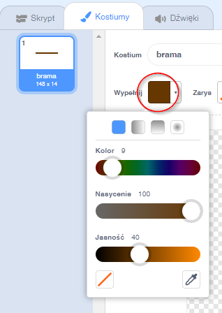

## Przeszkody i przyspieszacze

W tym momencie gra jest **zbyt** łatwa, więc dodasz kilka rzeczy, aby uczynić ją bardziej interesującą.

Najpierw dodasz kilka przyspieszaczy, aby przyspieszyć łódź.

\--- task \---

Edytuj tło sceny, dodając białe strzałki przyspieszające.


\--- /task \---

\--- task \---

Teraz dodaj więcej bloków kodu do pętli `zawsze`{:class="block3control"}, aby duszek łodzi poruszał się o trzy dodatkowe kroki, gdy dotknie białej strzałki. 

```blocks3
jeżeli < dotyka koloru [#Ffffff] ?> to
przesuń o (3) kroki
koniec
```

\--- /task \---

\--- task \---

Przetestuj grę, aby zobaczyć, czy nowe strzałki przyspieszające przyspieszają łódź.

\--- /task \---

Następnie dodasz obrotową bramę, której łódź musi unikać.

\--- task \---

Dodaj nowego duszka, który wygląda tak, i nazwij go „brama”:


Upewnij się, że kolor duszka bramy jest taki sam jak kolor drewnianych barier.



\--- /task \---

\--- task \---

Make sure that the centre of the gate sprite is positioned in the middle.


\--- /task \---

\--- task \---

Add code to your gate sprite to make it spin slowly forever.

\--- hints \--- \--- hint \--- Add code blocks to the gate sprite so that it `turns 1 degree`{:class="block3motion"} `forever`{:class="block3control"}. \--- /hint \--- \--- hint \--- Here are the code blocks you need: 

```blocks3
zawsze
koniec

obróć w prawo o (1) stopni

kiedy kliknięto zieloną flagę
```

\--- /hint \--- \--- hint \--- Here's what your new code should look like: 

```blocks3
kiedy kliknięto zieloną flagę
zawsze
obróć w prawo o (1) stopni
koniec
```

\--- /hint \--- \--- /hints \---

\--- /task \---

\--- task \---

Test your game again. You should now have a spinning gate that you need to stir your boat around.


\--- /task \---