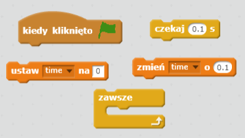
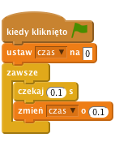

## Próba czasu

Dodajmy stoper do Twojej gry. Dzięki temu gracz będzie musiał dotrzeć do wyspy najszybciej jak to możliwe.

\--- task \---

Dodaj nową zmienną dla sceny i nazwij ją `czas`. Możesz również zmienić sposób wyświetlania zmiennej.

[[[generic-scratch-add-variable]]]

\--- /task \---

\--- task \---

Dodaj poniższy kod dla sceny. Sprawia on, że licznik czasu będzie się zwiększał aż do momentu, w którym łódź dotknie piaszczystej wyspy.

\--- hints \--- \--- hint \--- Na scenie, `po kliknięciu zielonej flagi`, `ustaw czas na 0`. Wewnątrz bloku `zawsze` musisz najpierw `poczekać 0,1 sekundy `, następnie `zmień czas o 0,1`. \--- /hint \--- \--- hint \--- Oto bloki kodu, których będziesz potrzebować:  \--- /hint \--- \--- hint \--- Tak powinien wyglądać twój kod:  \--- /hint \--- \--- /hints \---

\--- /task \---

\--- task \---

To tyle! Sprawdź swoją grę i przekonaj się jak szybko możesz dostać się na bezludną wyspę!

\--- /task \---