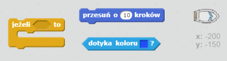
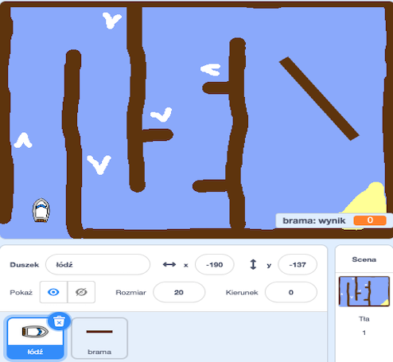
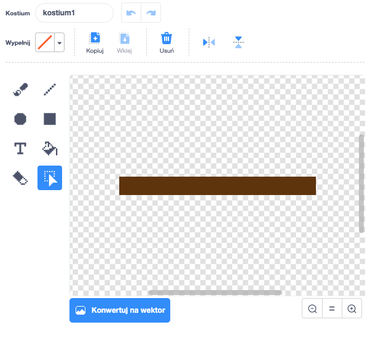
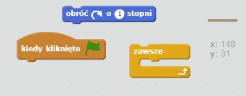
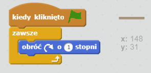

## Przeszkody i doładowania

W tym momencie gra jest *zdecydowanie* za łatwa - dodajmy kilka rzeczy, dzięki którym będzie ciekawsza.

--- task ---

Najpierw dodajmy "przyspieszacze", dzięki którym łódź będzie mogła zwiększyć swoją prędkość. Zmień tło sceny i dodaj kilka białych strzałek.

--- /task ---

--- task ---

Teraz dodaj nieco nowego kodu do bloku pętli zawsze łodzi, aby przesuwała się o 2 dodatkowe kroki za każdym razem, gdy dotknie białej strzałki.

--- hints --- --- hint --- `Jeżeli` twoja łódź `dotyka białej strzałki`, powinna wtedy `przejść 2 dodatkowe kroki`.  
--- /hint --- --- hint --- Oto bloki kodu, których będziesz potrzebować:  --- /hint --- --- hint --- Tak powinien wyglądać twój kod:  --- /hint --- --- /hints ---

--- /task ---

--- task ---

Możesz dodać także obrotową bramkę, którą łódź będzie musiała omijać. Dodaj nowego duszka i nazwij go "brama". Twój duszek powinien wyglądać tak:

Upewnij się, że kolor bramy jest taki sam, jak kolor drewnianych kłód.

--- /task ---

--- task ---

Ustaw środek duszka bramy.

--- /task ---

--- task ---

Dodaj kod do bramy, aby się zawsze powoli obracała.

--- hints --- --- hint --- Dodaj kod do duszka-bramy, aby `zawsze ` `obracał się o 1 stopień`. --- /hint --- --- hint --- Oto bloki kodu, których będziesz potrzebować:  --- /hint --- --- hint --- Tak powinien wyglądać twój kod:  --- /hint --- --- /hints ---

--- /task ---

--- task ---

Przetestuj swoją grę. Powinna teraz wirować, a ty musisz jej unikać.

--- /task ---