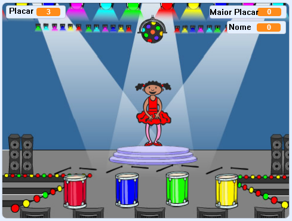

## O que vem a seguir?

Parabéns por concluir o projeto 'Corrida de Barco'! Gostaria de tentar algo um pouco mais desafiador?

Você poderia experimentar o projeto [Memória](https://projects.raspberrypi.org/pt-BR/projects/memory?utm_source=pathway&utm_medium=whatnext&utm_campaign=projects).

--- no-print --- Click on the green flag to start. Observe a sequência de cores mostrada pelo vestido da bailarina e ouça as batidas de tambor que as acompanham e repita-as de volta para ela. Se você errar a ordem, o jogo acaba!

  <iframe allowtransparency="true" width="485" height="402" src="//scratch.mit.edu/projects/embed/284452634/?autostart=false" frameborder="0" allowfullscreen scrolling="no" mark="crwd-mark"></iframe> 

--- /no-print ---

--- print-only ---  --- /print-only ---