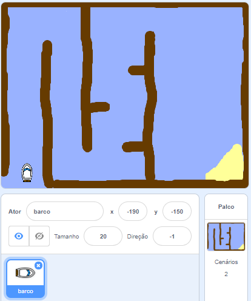

## Como começar

\--- task \---

Abra o projeto inicial.

## \--- collapse \---

title: Estou usando o Scratch on-line

## image: images/image.png

Abra o projeto inicial de Scratch 'Corrida de Barco' em [ jumpto.cc/boat-go ](https://scratch.mit.edu/projects/63958014/#editor) {:target="_blank"}. \--- /collapse \---

## \--- collapse \---

title: Estou usando o Scratch on-line

## image: images/image.png

Faça o download do projeto inicial do Scratch 'Corrida de Barco' em [ jumpto.cc/boat-get ](http:jumpto.cc/boat-get){:target="_blank"} e depois abra usando o editor offline. \--- /collapse \---

\--- /task \---

\--- task \---

O projeto inclui um sprite de barco e um cenário de percurso com:

- Madeira que seu barco deve evitar
- Uma ilha deserta que seu barco tem que chegar
    
    

\--- /task \---