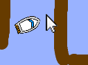
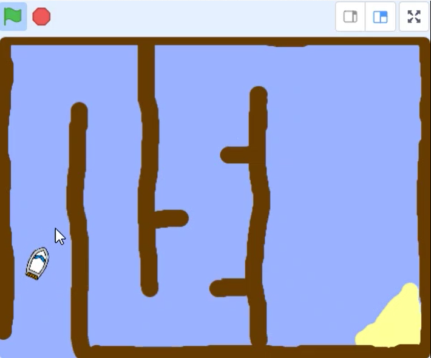

## Controlando o barco

O jogador irá controlar o barco com o mouse.

--- task --- Adicione o código ao ator barco para que ele comece no canto inferior esquerdo apontando para cima e depois siga o ponteiro do mouse.


```blocks3
when flag clicked
point in direction (0)
go to x: (-190) y: (-150)
forever
point towards (ponteiro do mouse v)
move (1) steps
```

--- /task ---

--- task ---

**Teste seu código** clicando na bandeira verde e movendo o mouse. O barco se move em direção ao ponteiro do mouse?



--- no-print --- 
 
--- /no-print ---

--- print-only --- 
 
--- /print-only ---

--- /task ---

--- task ---

O que acontece quando o barco alcança o ponteiro do mouse? Faça testes para identificar qual é o problema.

--- /task ---

--- task ---

Para impedir que isso aconteça, você precisará adicionar um bloco `se`{:class="block3control"} a seu código, para que o barco mova-se apenas se estiver a mais de 5 pixels de distância do mouse.

--- hints ---
 --- hint ---

O barco deve apontar em direção ao mouse e mover-se somente `se`{:class="block3control"} a `distância até o ponteiro do mouse`{:class="block3sensing"} for `maior que 5 pixels`{:class="block3operators"}. 
 --- /hint ---
--- hint ---

 Estes são os blocos de código que você precisa adicionar ao código da imagem do barco: 

```blocks3
if < [ ] > [ ] > then

(distance to (ponteiro do mouse v))
```

--- /hint --- --- hint --- 
Seu código deve ficar assim: 

```blocks3
when flag clicked
point in direction (0)
go to x: (-190) y: (-150)
forever
+if <(distance to (ponteiro do mouse v)) > [5]> then
point towards (ponteiro do mouse v)
move (1) steps
```

--- /hint ---
--- /hints ---


--- /task ---

--- task ---

Teste seu código novamente para verificar se o problema foi corrigido.

--- /task ---