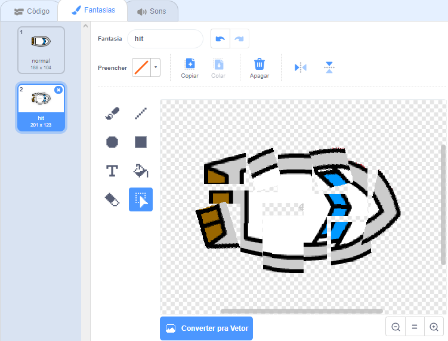

## Batendo!

Por enquanto, a imagem do barco pode simplesmente navegar através das barreiras de madeira! Você vai corrigir isso agora.

\--- task \---

Você precisará de duas fantasias (imagens) para representar o seu barco (ator), uma imagem normal e outra para quando o barco bater. Duplique a imagem do barco e nomeie um deles como "normal" e o outro como "hit" (batido).

\--- /task \---

\--- task \---

Clique na sua imagem 'batido' e use a ferramenta de ** Selecionar ** para para mover e girar partes da imagem e assim fazer parecer que o barco bateu e se quebrou.



\--- /task \---

\--- task \---

Agora adicione código ao seu barco para que ele bata e quebre quando ele tocar nos pedaços de madeira marrom.

\--- dicas \--- \--- dica \--- Você precisa adicionar blocos de código dentro do bloco de repetição ` sempre` {: class = "block3control"} para que seu código continue verificando se o barco se chocou, e caso tiver se chocado, o código precisa reiniciar a a imagem do barco para a normal.

` se ` {: class = "block3control"} o barco estiver ` tocando` {: class = "block3sensing"} na cor marrom da madeira, você precisa mudar para a fantasia 'hit' (batida) com o bloco `mude para a fantasia hit ` {: class = "block3looks"}, ` e dizer Nãoooo! por 2 segundos ` {: class = "block3looks"} e, em seguida, ` mude para a fantasia normal ` {: class = "block3looks"}. Finalmente, você precisará ` apontar para cima ` {: class = "block3motion"} e ` ir para a posição inicial ` {: class = "block3motion"}.

\--- /hint \--- \--- hint \--- Aqui estão os blocos que você vai precisar: 

```blocks3
if <touching color [ ] ?> then
end

go to x: (-190) y: (-150)

switch costume to (hit v)

point in direction (0)

switch costume to (normal v)

say [Noooooo!] for (2) seconds
```

\--- /hint \--- \--- hint \--- Seu código deve ficar assim: 

```blocks3
when flag clicked
point in direction (0)
go to x: (-190) y: (-150)
forever
if <(distance to (mouse-pointer v)) > [5]> then
point towards (mouse-pointer v)
move (1) steps
end
if <touching color [#663b00] ?> then
switch costume to (hit v)
say [Nãoooo!] for (2) seconds
switch costume to (normal v)
point in direction (0)
go to x: (-190) y: (-150)
end
```

\--- /hint \--- \--- /hints \---

\--- /task \---

\--- task \---

Você também deve ter certeza de que seu barco sempre comece a imagem de aparência "normal".

Teste seu código novamente. Se você tentar navegar o barco através de uma barreira de madeira agora, o barco deve colidir e então voltar para a sua posição inicial.


\--- /task \---