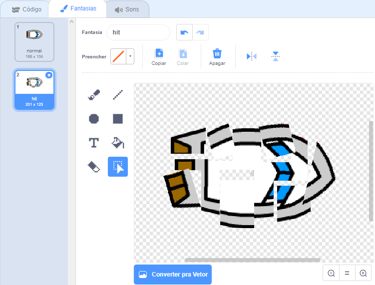
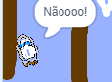

## Batendo!

Por enquanto, o barco pode simplesmente navegar através das barreiras de madeira! Você vai corrigir isso agora.

--- task ---

Você precisará de duas fantasias para representar o seu barco, uma fantasia normal e outra para quando o barco bater. Duplique a fantasia do barco e nomeie uma delas como "normal" e o outro como "batido".

--- /task ---

--- task ---

Clique na sua fantasia 'batido' e use a ferramenta de **Selecionar** para para mover e girar partes da fantasia e assim fazer parecer que o barco bateu e se quebrou.



--- /task ---

--- task ---

Agora adicione código ao seu barco para que ele bata e quebre quando ele tocar barreiras de madeira marrom.

--- hints ---
 --- hint ---

Você precisa adicionar blocos de código dentro do bloco de repetição `sempre`{:class="block3control"} para que seu código continue verificando se o barco se chocou, e caso tiver se chocado, o código precisa reiniciar a posição do barco.

`se`{:class="block3control"} o barco estiver `tocando`{:class="block3sensing"} na cor marrom da madeira, você precisa mudar para a fantasia 'batida' com o bloco `mude para a fantasia 'batida'`{:class="block3looks"}, `e dizer Nãoooo! por 2 segundos`{:class="block3looks"} e, em seguida, `mude para a fantasia normal`{:class="block3looks"}. Finalmente, você precisará `apontar para cima`{:class="block3motion"} e `ir para a posição inicial`{:class="block3motion"}.

--- /hint ---
--- hint ---

Aqui estão os blocos que você vai precisar: 

```blocks3
if <touching color []?> then
end

go to x: (-190) y: (-150)

switch costume to (batido v)

point in direction (0)

switch costume to (normal v)

say [Nãooooo!] for (2) seconds
```

--- /hint ---
--- hint ---
Seu código deve ficar assim:


```blocks3
when flag clicked
point in direction (0)
go to x: (-190) y: (-150)
forever
if <(distance to (mouse-pointer v)) > [5]> then
point towards (mouse-pointer v)
move (1) steps
end
+if <touching color [#663b00] ?> then 
switch costume to (batido v)
say [Nãoooo!] for (2) seconds
switch costume to (normal v)
point in direction (0)
go to x: (-190) y: (-150)
end
```

--- /hint ---
--- /hints ---

--- /task ---

--- task ---

Você também deve ter certeza de que seu barco sempre comece com a fantasia "normal".

Teste seu código novamente. Se você tentar navegar o barco através de uma barreira de madeira agora, o barco deve colidir e então voltar para a sua posição inicial.



--- /task ---