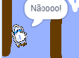

## Batendo!

No momento, seu barco pode navegar pelas barreiras de madeira! Vamos consertar isso.

\--- task \---

Você precisará de dois trajes para o seu barco, um traje normal e outro para quando o barco bater. Duplique seu traje de barco e nomeie um deles como "normal" e o outro como "batido".

\--- /task \---

\--- task \---

Clique em seu traje 'batido' e escolha a ferramenta Selecionar para pegar pedaços do barco e movê-los e girá-los para parecer que ele está com defeito.

\--- /task \---

\--- task \---

Agora adicione código ao seu barco para que ele bata e quebre quando ele tocar em pedaços de madeira marrom.

\--- hints \--- \--- hint \--- Você precisa adicionar código dentro do loop `sempre` para que o seu código continue a verificar se o barco falhou. `Se` o barco está `tocando` na cor marrom da madeira, você precisa `mudar para o traje batido` , `diga Nãããão! por 2 segundos` e, em seguida, `volte para o traje normal` . Finalmente, você precisará `apontar para cima` e `ir para a posição inicial` . \--- /hint \--- \--- hint \--- Aqui estão os blocos de código que você precisará:  \--- /hint \--- \--- hint \--- Isto é como seu código deve se parecer:  \--- /hint \--- \--- /hints \---

\--- /task \---

\--- task \---

Você também deve certificar-se de que seu barco sempre comece a aparência "normal".

Se você tentar navegar através de uma barreira de madeira agora, você deve ver que seu barco bate e se move de volta para o início.

\--- /task \---