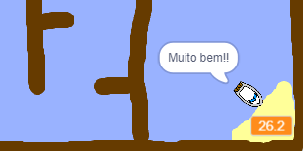

## Adicionando um cronômetro

Vamos adicionar um cronômetro a seu jogo para que o jogador tenha que chegar à ilha o mais rápido possível.

\--- task \---

Adicione uma nova variável chamada ` tempo` {:class="block3variables"} ao Palco.


[[[generic-scratch3-add-variable]]]

Você também pode escolher um visual para seu cronômetro, alterando a forma como sua nova variável é exibida.

\--- /task \---

\--- task \---

Agora adicione blocos de código ao Palco para que o cronômetro faça contagem do tempo até que o barco chegue à ilha.

\--- hints \--- \--- hint \---

On the Stage, `when the green flag is clicked`{:class="block3control"}, `set the time to 0`{:class="block3variables"}. Inside your `forever`{:class="block3control"} loop, you'll need to first `wait 0.1 secs`{:class="block3control"}, then `change the time by 0.1`{:class="block3variables"}.

\--- /hint \--- \--- hint \---

Here are the code blocks you'll need:


```blocks3
adicione (0.1) a [time v]

quando ⚑ for clicado

sempre
end

espere (0.1) seg

mude [time v] para [0]
```

\--- /hint \--- \--- hint \---

Here's what your new code should look like:


```blocks3
quando ⚑ for clicado
mude [time v] para [0]
sempre 
 espere (0.1) seg
 adicione (0.1) a [time v]
fim
```

\--- /hint \--- \--- /hints \---

\--- /task \---

\--- task \---

Test out your game and see how quickly you can get the boat to the island!



\--- /task \---