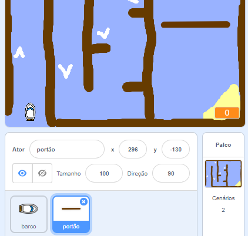
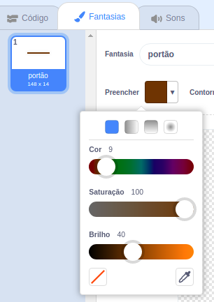
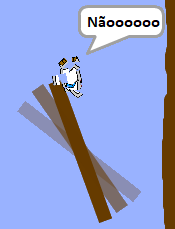

## Obstáculos e aceleradores

Por enquanto o jogo está **bastante** fácil, então você adicionará algumas coisas para torná-lo mais interessante.

Primeiro, você adicionará alguns aceleradores para acelerar o barco.

--- task ---

Edite o pano de fundo do Palco adicionando algumas setas de reforço brancas.


--- /task ---

--- task ---

Agora adicione mais código ao bloco de repetição `sempre`{:class="block3control"} de seu barco para que a imagem do barco mova três passos extras quando ele tocar uma seta branca. 

```blocks3
se <touching color [#FFFFFF] ?> então
mova (3) passos
fim
```

--- /task ---

--- task ---

Teste seu jogo para ver se suas novas setas de aceleração aceleram o barco.

--- /task ---

Em seguida, você adicionará um portão giratório que o barco deve evitar.

--- task ---

Adicione um novo ator com esta aparência e chame-a de "portão":



Certifique-se de que a cor do portão seja a mesma cor das barreiras de madeira.



--- /task ---

--- task ---

Certifique-se que o centro do ator portão está posicionado no meio.


--- /task ---

--- task ---

Adicione código ao seu ator portão para fazê-lo girar lentamente para sempre.

--- hints ---
 --- hint --- Adicione blocos de código ao ator portão para que ele `gire 1 grau`{:class="block3motion"}, `sempre`{:class="block3control"}.
--- /hint ---
 --- hint --- Aqui estão os blocos que você vai precisar: 

```blocks3
sempre
fim

gire para a direita (1) graus

quando ⚑ for clicado
```

--- /hint --- --- hint --- Seu código deve ficar assim: 

```blocks3
quando ⚑ for clicado
sempre 
 gire para direita (1) graus
fim
```

--- /hint ------ /hints ---

--- /task ---

--- task ---

Teste seu jogo novamente. Agora você deve ter um portão giratório do qual você precisa desviar com seu barco.



--- /task ---