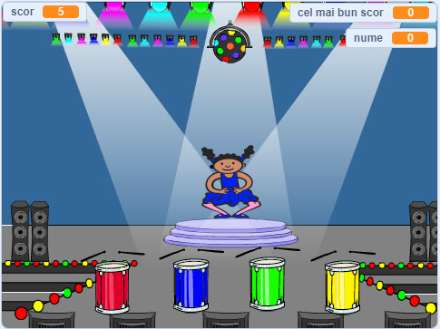

## Ce urmează?

Felicitări pentru finalizarea proiectului „Cursă cu bărcuțe”! Vrei să încerci ceva mai greu?

Ai putea să încerci proiectul nostru [Memorie](https://projects.raspberrypi.org/en/projects/memory?utm_source=pathway&utm_medium=whatnext&utm_campaign=projects).

\--- no-print \--- Dă click pe stegulețul verde pentru a începe. Urmărește secvența de culori afișată pe rochia balerinei și ascultă sunetul tobelor, apoi repetă-i-le. În cazul în care ordinea culorilor e greșită, jocul s-a terminat!

  <iframe allowtransparency="true" width="485" height="402" src="//scratch.mit.edu/projects/embed/284452634/?autostart=false" frameborder="0" allowfullscreen scrolling="no" mark="crwd-mark"></iframe> 

\--- /no-print \---

\--- print-only \---  \--- /print-only \---