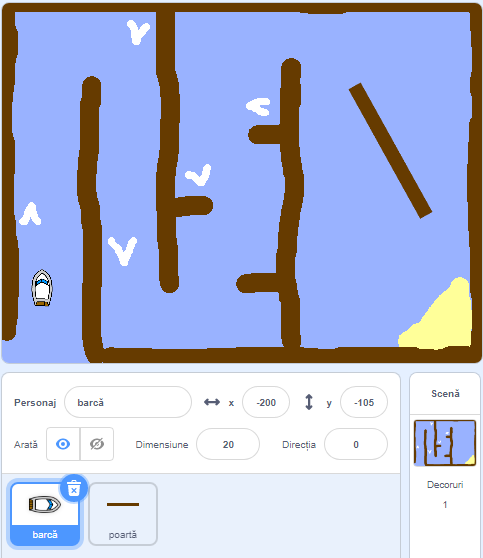

## Noţiuni de bază

\--- task \---

Deschideti noul proiect.

## \--- collapse \---

titlu: Folosesc Scratch online

## image: images/image.png

Deschide noul proiect ‘Cursă Bărci’ la[jumpto.cc/boat-go](https://scratch.mit.edu/projects/63958014/#editor){:target="_blank"}. \--- /collapse \---

## \--- collapse \---

title: Folosesc Scratch offline

## image: images/image.png

Descarcă proiectul ‘Cursă Bărci’ de la[jumpto.cc/boat-get](http:jumpto.cc/boat-get){:target="_blank"} apoi deschide-l folosind editorul offline. \--- /collapse \---

\--- /task \---

\--- task \---

Proiectul include un tur de barcă și un fundal de cursa cu:

- Lemne pe care barca trebuie să le evite
- O insulă pustie la care trebuie sa ajunga barca
    
    

\--- /task \---