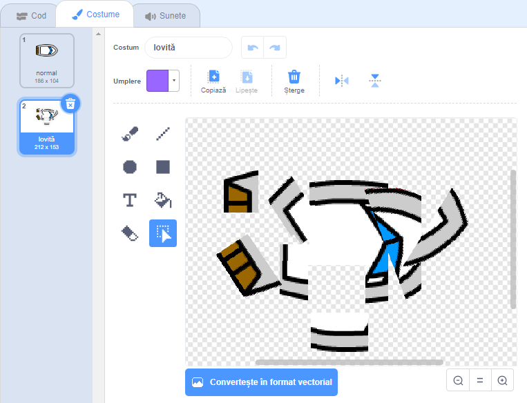
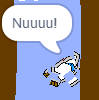

## Accidentele!

Pentru moment, barca ta poate naviga printre barajele de lemne! Haide sa o corectam.

\--- proba\---

O sa ai nevoie de doua profiluri pentru barca ta, unul normal, si unul pentru barca care se loveste de lemne. Dubleaza profilul barcii, si pune-i un nume ca 'normal' iar celalalt 'lovitura'.

\--- /proba\---

\--- proba\---

Apasa pe profil 'lovitura' si alege instrumentul Selectare, pentru a apuca aschii din barca pentru a le misca si roti astfel incat sa para ca un accident.

\--- /proba\---

\--- proba\---

Acum adauga codul la barca ta astfel incat sa se loveasca si rupa atunci cand atinge bucati de lemn.

\--- hints \--- \--- hint \--- Adauga codul tau `totdeauna` in bucla repetitiva, astfel incat, acesta sa verifice mereu, daca barca se loveste. `If` the boat is `touching` the brown colour of the wood, you need to `switch to the hit costume`, `say Noooo! for 2 seconds`, and then `switch back to the normal costume`. Finally, you'll need to `point up` and `go to the start position`. \--- /hint \--- \--- hint \--- Here are the code blocks you'll need:  \--- /hint \--- \--- hint \--- Here's what your code should look like:  \--- /hint \--- \--- /hints \---

\--- /task \---

\--- task \---

You should also make sure that your boat always starts out looking 'normal'.

If you try to sail through a wooden barrier now, you should see that your boat crashes and moves back to the start.

\--- /task \---