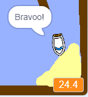

## Durata cursei

Haide sa adaugam si timpul, pentru ca jucatorul sa ajunga cat mai repede.

\--- task \---

Adauga o noua variabila `timp` acestei etape. Vei putea modifica ecranul noii variabile.

[[[generic-scratch-add-variable]]]

\--- /task \---

\--- task \---

Acum adauga un bloc, in acest ecran, astfel incat ceasul va merge pana cand barca ajunge la insula parasita.

\--- hints \--- \--- hint \--- Pe ecran, `atunci cand steagul este apasat`, `pune timpul la 0`. In interiorul blocului `totdeauna` va trebui sa ` asteapta 0.1 secs`, apoi `schimba timpul de 0.1`ori. \--- /hint \--- \--- hint \--- Acestea sunt blocurile necesare:  \--- /hint \--- \--- hint \--- Asa ar trebui sa arate:  \--- /hint \--- \--- /hints \---

\--- /task \---

\--- task \---

Asta e tot! Testeaza jocul şi vei vedea cât de repede poti ajunge la insula pustie!

\--- /task \---