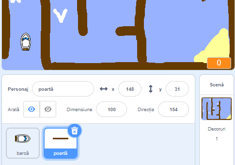
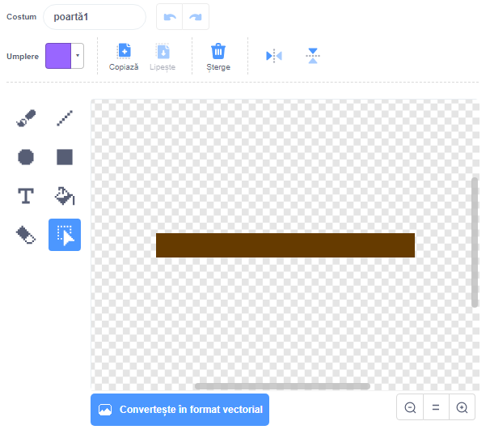
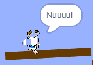

## Obstacolele si acceleratia

Pana acum jocul e de*departe* prea usor - haide sa-i adaugam lucruri sa para mult mai atractiv.

\--- proba\---

Mai intai, haide sa adaugam jocului tau ceva 'viteza' pentru a putea accelera barca. Editeaza fundalul de joc si adauga cateva sageti albe.

\--- /proba\---

\--- proba\---

Acum, adauga-i barcii tale o noua bucla repetitiva astfel incat de fiecare data cand atinge o sageata sa se deplaseze cu trei pasi suplimentari.

\--- hints \--- \--- hint \--- `daca` barca `atinge o sageata alba`, atunci ar trebui sa`avanseze 3 pasi`.  
\--- /hint \--- \--- hint \--- Acestea sunt blocurile de care ai nevoie:  \--- /hint \--- \--- hint \--- Asa ar trebui sa arate blocul tau de comenzi:  \--- /hint \--- \--- /hints \---

\--- /proba\---

\--- proba\---

Poti adăuga, de asemenea, o poarta care se roteste, pe care barca ta va trebui să o evite. Adauga un sprite nou numit "poarta", care arata ca aceasta:

Asigura-te că culoarea porții este aceeași cu cea a barierelor din lemn.

\--- /proba\---

\--- proba\---

Seteaza centrul portii rotitoare.

\--- /proba\---

\--- proba\---

Adauga codul la poarta ta pentru a o face să se rotească încet, mereu.

\--- hints \--- \--- hint \--- Add code to the gate sprite so that it `turns 1 degree` `forever`. \--- /hint \--- \--- hint \--- Here are the code blocks you'll need:  \--- /hint \--- \--- hint \--- Here's what your code should look like:  \--- /hint \--- \--- /hints \---

\--- /task \---

\--- task \---

Test out your game. You should now have a spinning gate that you must avoid.

\--- /task \---