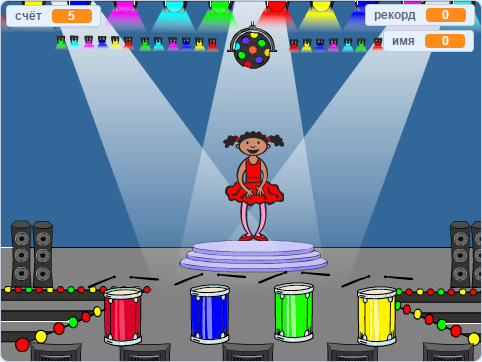

## Что дальше?

Поздравляем с завершением проекта «Лодочная гонка»! Ты хочешь создать что-то более сложное?

Попробуй проект [Память](https://projects.raspberrypi.org/en/projects/memory?utm_source=pathway&utm_medium=whatnext&utm_campaign=projects).

\--- no-print \---

Нажми на зелёный флаг, чтобы начать. Посмотри на последовательность цветов, которую покажет платье балерины и послушай сопровождающие удары барабана, а затем повтори цвета. Если ты выберешь цвета неправильно, то игра закончится!

  <iframe allowtransparency="true" width="485" height="402" src="//scratch.mit.edu/projects/embed/284452634/?autostart=false" frameborder="0" allowfullscreen scrolling="no"></iframe> 

\--- /no-print \---

\--- print-only \---

\--- /print-only \---