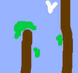
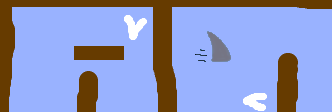
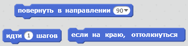
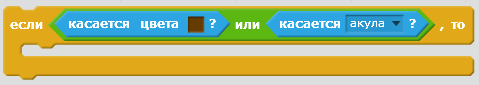

\--- challenge \---

## Задача: больше препятствий!

Можешь ли ты добавить в свою игру больше препятствий? Вот несколько идей:

\--- task \---

Ты можешь добавить в фон зеленую слизь и внести изменения в игру, чтобы слизь замедляла лодку, когда та касается её.

\--- hints \--- \--- hint \--- Для этого ты можешь использовать блок `ждать`:  \--- /hint \--- \--- /hints \---

\--- /task \---

\--- task \---

Ты можешь добавить движущийся объект, похожий на бревно или акулу!

\--- hints \--- \--- hint \--- Эти блоки могут помочь тебе перемещать твой новый объект:

Если твой новый объект не коричневый, то тебе нужно добавить вот это в код лодки:

 \--- /hint \--- \--- /hints \---

\--- /task \---

\--- /challenge \---