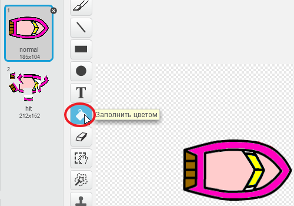
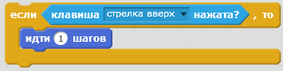

\--- challenge \---

## Задача: больше лодок!

Можешь ли ты превратить свою игру в гонку между двумя игроками? Второй игрок должен будет управлять своей лодкой, используя стрелку вверх, чтобы двигаться вперед, а клавиши со стрелками влево и вправо - для поворота.

\--- hints \--- \--- hint \--- Сделай копию лодки и измени цвет для лодки2.

 \--- /hint \--- \--- hint \--- Размести лодки в разных местах, изменив этот код:

 \--- /hint \--- \--- hint \--- Измени код лодки2 так, чтобы вместо мыши использовались клавиши со стрелками. \--- /hint \--- \--- hint \--- Этот код позволит тебе двигать лодку2 вперёд:

 \--- /hint \--- \--- hint \--- Тебе также потребуется код для *поворота* лодки при нажатии клавиш со стрелками влево и вправо. \--- /hint \--- \--- /hints \---

\--- /challenge \---