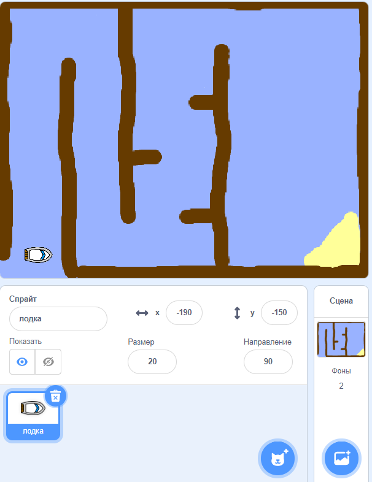

## Начало работы

\--- task \--- Open the starter project.

**Online:** open the online starter project at [rpf.io/boat-race-starter-on](http://rpf.io/boat-race-starter-on){:target="_blank"}.

Если у тебя есть учетная запись Scratch, то ты можешь сделать копию, нажав **Ремикс**.

**Offline:** download the offline starter project from [rpf.io/p/en/boat-race-go](http://rpf.io/p/en/boat-race-go){:target="_blank"}, and then open it using the offline editor.

Если вам нужно скачать и установить оффлайн редактор Scratch, вы можете найти его по адресу [rpf.io/scratchoff](http://rpf.io/scratchoff) \--- /task \---

\--- task \---

The project includes a boat sprite, and a race course backdrop with:

- Wood that the boat sprite has to avoid
- A desert island that the boat has to reach
    
    

\--- /task \---