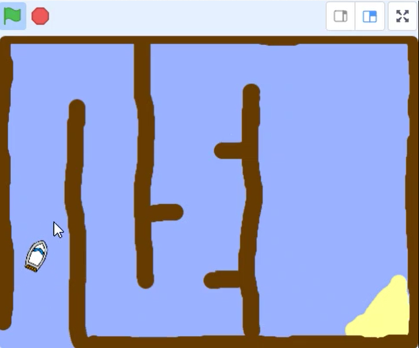

## Управление лодкой

Игрок будет управлять спрайтом лодки с помощью мыши.

--- task ---

Добавь для своей лодки код, который с самого начала разместит её в нижнем левом углу, направлением вверх и будет двигать её за указателем мышки.


```blocks3
when flag clicked
point in direction (0)
go to x: (-190) y: (-150)
forever
point towards (mouse-pointer v)
move (1) steps
```

--- /task ---

--- task ---

**Протестируй свой код**, щёлкнув зелёный флаг и переместив мышь. Спрайт лодки движется к указателю мыши?


--- no-print ---


--- /no-print ---

--- print-only ---



--- /print-only ---

--- /task ---

--- task ---

Что происходит, когда лодка достигает указателя мыши? Попробуй это, чтобы увидеть, в чём проблема.

--- /task ---

--- task ---

Чтобы этого не происходило, добавь в свой код блок `если`{:class="block3control"}, так, чтобы лодка двигалась только тогда, когда она находится на расстоянии более 5 пикселей от указателя мыши.

--- hints ---
 --- hint ---

Лодка должна быть направлена только в сторону указателя мыши и двигаться `если`{:class="block3control"} `расстояние до указателя мыши`{:class="block3sensing"} `больше 5 пикселей`{:class="block3operators"}.

--- /hint --- --- hint ---

Вот блоки кода, которые нужно добавить в программу для спрайта лодка:


```blocks3
if < [ ] > [ ] > then

(distance to (mouse-pointer v))
```

--- /hint --- --- hint ---

Так должен выглядеть твой код:


```blocks3
when flag clicked
point in direction (0)
go to x: (-190) y: (-150)
forever
if <(distance to (mouse-pointer v)) > [5]> then
point towards (mouse-pointer v)
move (1) steps
```

--- /hint ------ /hints ---

--- /task ---

--- task ---

Ещё раз проверь свой код, чтобы убедиться, что проблема устранена.

--- /task ---