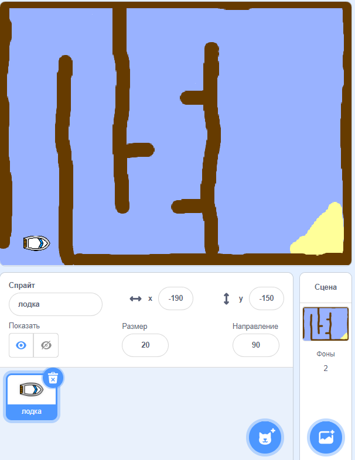

## Начало работы

\--- task \---

Открой начальный проект.

## \--- collapse \---

title: Я используй онлайн-версию Scratch

## image: images/image.png

Открой начальный проект 'Boat Race' для Scratch по ссылке [jumpto.cc/boat-go](https://scratch.mit.edu/projects/63958014/#editor){:target="_blank"}. \--- /collapse \---

## \--- collapse \---

title: Я использую автономную (офлайн) версию Scratch

## image: images/image.png

Загрузи начальный проект 'Boat Race' для Scratch по ссылке [jumpto.cc/boat-get](http:jumpto.cc/boat-get){:target="_blank"}, а затем открой его, используя автономный (офлайн) редактор. \--- /collapse \---

\--- /task \---

\--- task \---

Проект включает в себя спрайт-лодку и фоновую картинку, на которой можно заметить:

- Брёвна, которых не должна касаться твоя лодка
- Пустынный остров, до которого лодке предстоит добраться
    
    

\--- /task \---