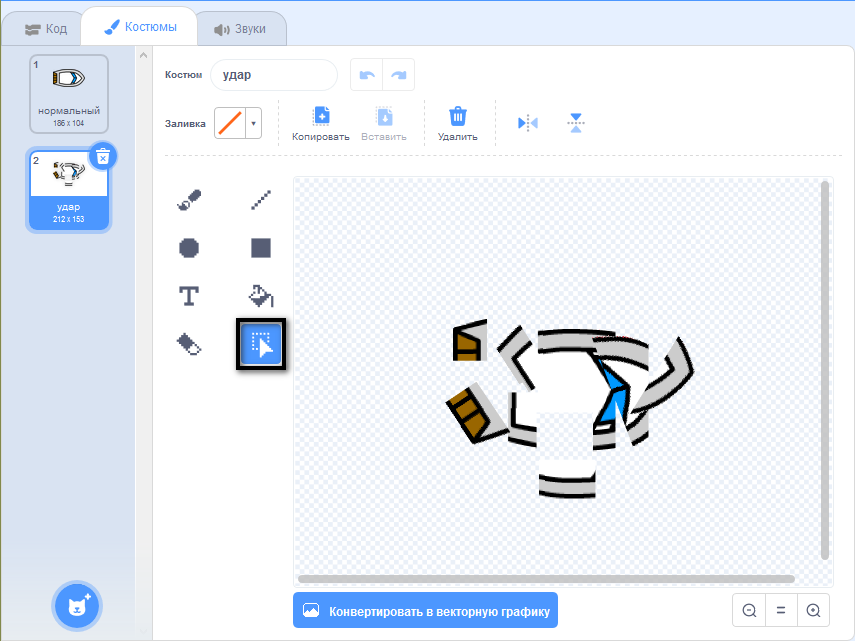

## Авария!

На данный момент спрайт лодки может просто проплывать через деревянные преграды! Сейчас ты это исправишь.

\--- task \---

Тебе понадобится два костюма для твоего спрайта лодки: один нормальный костюм, а другой на случай крушения лодки. Продублируй костюм спрайта лодки и назови один костюм «нормальный», а другой - «удар».

\--- /task \---

\--- task \---

Нажми на свой костюм «удар» и воспользуйся инструментом **Выбрать**, чтобы выделять части костюма, перемещать и вращать их, чтобы лодка выглядела так, как будто она разбилась на части.



\--- /task \---

\--- task \---

Теперь добавь код к своей лодке, чтобы она разрушалась и разбивалась на части при соприкосновении с коричневыми деревянными преградами.

\--- hints \--- \--- hint \---

Тебе нужно добавить блоки кода внутри цикла `навсегда`{:class="block3control"}, чтобы твой код продолжал проверять состояние спрайта лодки, и в случае аварии код должен сбросить положение спрайта лодки в самое начало.

`если`{:class="block3control"} лодка `касается цвета`{:class="block3sensing"} коричневого цвета дерева, тебе нужно `изменить костюм на удар`{:class="block3looks"}, `сказать Нееееет! в течение 2 секунд`{:class="block3looks"}, а затем `изменить костюм на нормальный`{:class="block3looks"}. Наконец, тебе нужно `повернуться вверх`{:class="block3motion"} и `перейти в начальную позицию`{:class="block3motion"}.

\--- /hint \--- \--- hint \---

Вот блоки кода, которые тебе нужны:


```blocks3
if <touching color [ ] ?> then
end

go to x: (-190) y: (-150)

switch costume to (hit v)

point in direction (0)

switch costume to (normal v)

say [Noooooo!] for (2) seconds
```

\--- /hint \--- \--- hint \---

Вот как должен выглядеть твой код:


```blocks3
when flag clicked
point in direction (0)
go to x: (-190) y: (-150)
forever
if <(distance to (mouse-pointer v)) > [5]> then
point towards (mouse-pointer v)
move (1) steps
end
if <touching color [#663b00] ?> then
switch costume to (hit v)
say [Noooooo!] for (2) seconds
switch costume to (normal v)
point in direction (0)
go to x: (-190) y: (-150)
end
```

\--- /hint \--- \--- /hints \---

\--- /task \---

\--- task \---

Также тебе следует добавить код, чтобы твой спрайт лодки всегда выглядел «нормально».

Протестируй свой код ещё раз. Если ты попытаешься сейчас проплыть через деревянную преграду, лодка должна разбиться и вернуться в исходное положение.


\--- /task \---