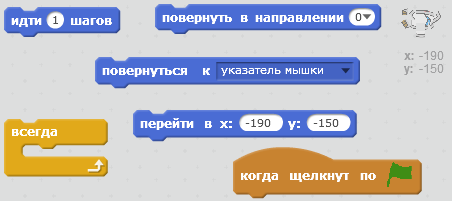
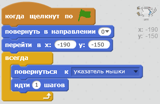
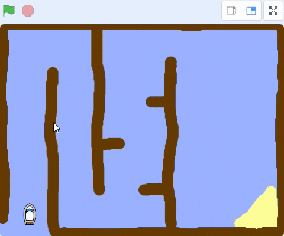
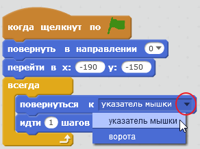
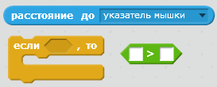
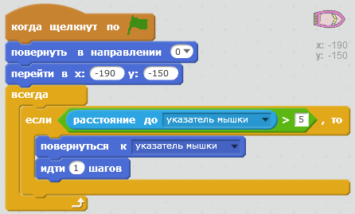

## Управление лодкой

\--- task \---

Управлять лодкой ты будешь с помощью мыши. Добавь для своей лодки код, который разместит её в нижнем левом углу и научит двигаться за указателем мыши. **Проверь свой код**. Нужно, чтобы он выполнял то, что нужно.

\--- hints \--- \--- hint \--- `Когда щёлкнут по зелёному флагу`, нужно `переместить лодку в точку старта` и `направить её вверх`. Затем нужно определить `координаты указателя мыши` и `сделать шаг в его сторону`. Нужно повторить это `всегда`.

\--- /hint \--- \--- hint \--- Тебе понадобятся такие блоки кода:  \--- /hint \--- \--- hint \--- Твой код должен выглядеть как-то так:  \--- /hint \--- \--- /hints \---

\--- /task \---

\--- task \---

Проверь свою лодку, щелкнув по зелёном флагу и двигая мышью. Лодка плывет к мыши?

## \--- collapse \---

title: Если у тебя возникли проблемы...

## image: images/image.png

**Примечание:** на данный момент в Scratch есть ошибка: твоя лодка не может двигаться в направлении указателя мыши. Если это произойдет, щелкни стрелку в блоке `повернуть в направлении` и заново выбери `указатель мышки`.

 \--- /collapse \---

\--- /task \---

\--- task \---

Что произойдет, если лодка достигнет указателя мыши? Попробуй.

\--- /task \---

\--- task \---

Чтобы этого не произошло, добавь в свой код блок `если`, чтобы лодка двигалась только если она находится на расстоянии более 5 пикселей от мыши.

\--- hints \--- \--- hint \--- Лодка должна поворачиваться в сторону указателя мыши и двигаться к нему только `если` `расстояние до указателя мышки` более чем `5 пикселей`. \--- /hint \--- \--- hint \--- Эти блоки кода необходимо добавить к спрайту с лодкой:  \--- /hint \--- \--- hint \--- Твой код должен выглядеть как-то так:  \--- /hint \--- \--- /hints \---

\--- /task \---

\--- task \---

Снова проверь свою лодку, чтобы проверить, исправлена ​​ли проблема.

\--- /task \---