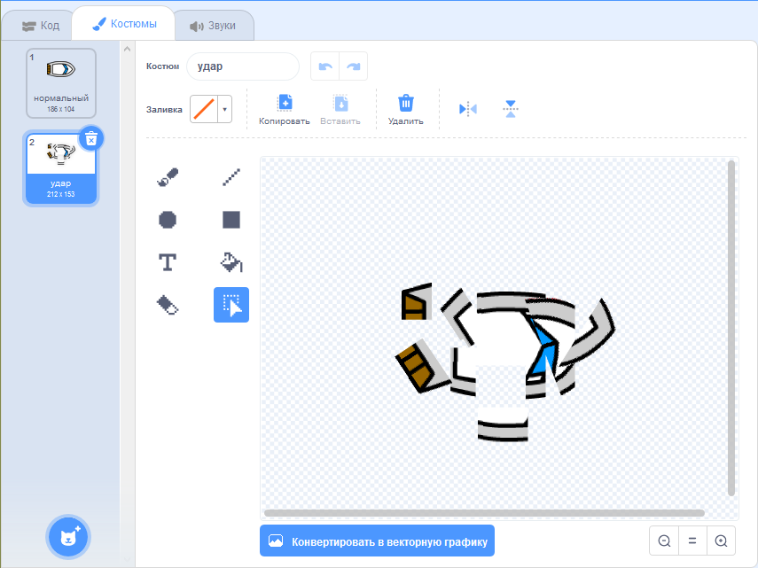
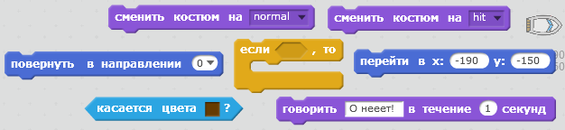
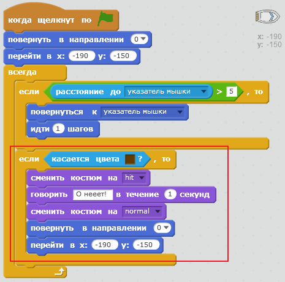
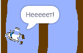

## Авария!

Сейчас твоя лодка может плыть сквозь деревянные барьеры! Давай исправим это.

\--- task \---

Тебе понадобится два костюма для лодки: один обычный, второй для аварийной ситуации. Дублируй свой костюм для лодки: одну копию назови 'normal' (обычное состояние), вторую - 'hit' (аварийное состояние).

\--- /task \---

\--- task \---

Щёлкни по костюму 'hit', выбери инструмент "Выбрать". С его помощью перемещай кусочки лодки, чтобы стало похоже, что она попала в аварию.

\--- /task \---

\--- task \---

Теперь нужно добавить код для лодки, чтобы она разбивалась при касании коричневых предметов.

\--- hints \--- \--- hint \--- Тебе понадобится добавить код в цикл `всегда`, чтобы твой код всё время проверял: цела ли лодка. `Если` лодка `коснётся` предмета коричесвого цвета (бревна), то нужно `сменить костюм на hit`, начать `говорить О нееет! в течение 2 секунд`, а затем `сменить костюм на normal`. Наконец, тебе понадобится `повернуть в направлении 0` и `вернуться в точку старта`. \--- /hint \--- \--- hint \--- Тебе понадобятся такие блоки кода:  \--- /hint \--- \--- hint \--- Твой код должен выглядеть как-то так:  \--- /hint \--- \--- /hints \---

\--- /task \---

\--- task \---

Также нужно проверить, что твоя лодка на старте всегда одета в «нормальный» костюм.

Если ты попытаешься проплыть сквозь деревянный барьер, то твоя лодка должна разбиться и вернуться в точку старта.

\--- /task \---