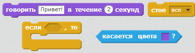
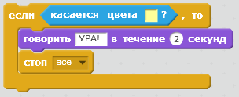

## Задача: победить!

Можешь ли ты добавить в код твоей лодки еще один блок `если`, чтобы игрок выигрывал, когда он доберётся до необитаемого острова?

Когда лодка попадает на желтый пустынный остров, игра должна сказать «УРА!» и остановиться.

\--- hints \--- \--- hint \--- Тебе понадобится добавить в цикл `всегда` код, проверяющий, победил ли игрок. `Если` лодка `касается` цвета острова сокровищ, то нужно `проговорить 'УРА!' в течении 2 секунд`, а затем применить`стоп ко всем` для завершения игры. \--- /hint \--- \--- hint \--- Тебе понадобятся такие блоки кода:  \--- /hint \--- \--- hint \--- Твой код должен выглядеть как-то так: 

Не забудь, что новый код должен быть внутри твоего цикла `всегда`. \--- /hint \--- \--- /hints \---