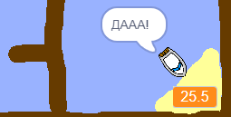

## Добавление таймера

Давай теперь добавим в твою игру таймер, чтобы игрок стремился добраться до острова побыстрее.

\--- task \---

Добавь новую переменную `время`{:class="block3variables"} на свою Сцену.


[[[generic-scratch3-add-variable]]]

Ты также можешь выбрать внешний вид своего таймера, изменив способ отображения новой переменной.

\--- /task \---

\--- task \---

Теперь добавьте блоки кода в свою Сцену, чтобы таймер отсчитывал, пока лодка не достигнет острова.

\--- hints \--- \--- hint \---

На Сцене, `когда зелёный флаг нажат`{:class="block3control"}, `установи время на 0`{:class="block3variables"}. Внутри цикла `повторять всегда`{:class="block3control"}, тебе нужно сначала `ждать 0.1 секудну`{:class="block3control"}, затем `изменить время на 0.1`{:class="block3variables"}.

\--- /hint \--- \--- hint \---

Вот блоки кода, которые тебе нужны:


```blocks3
change [time v] by (0.1)

when flag clicked

forever
end

wait (0.1) seconds

set [time v] to [0]
```

\--- /hint \--- \--- hint \---

Вот как должен выглядеть твой новый код:


```blocks3
when flag clicked
set [time v] to [0]
forever
wait (0.1) seconds
change [time v] by (0.1)
end
```

\--- /hint \--- \--- /hints \---

\--- /task \---

\--- task \---

Протестируй свою игру и посмотри, как быстро ты можешь довести лодку до острова!



\--- /task \---