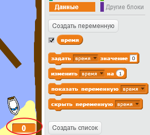
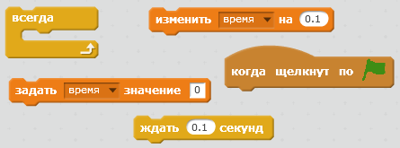
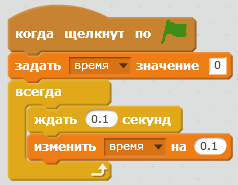
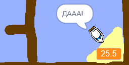

## Ограничение по времени

Давай добавим в твою игру таймер, чтобы игрок мог как можно быстрее добраться до необитаемого острова.

\--- task \---

Добавь на свою сцену переменную с именем `время`. Ты также можешь изменить вид новой переменной.

[[[generic-scratch-add-variable]]]

\--- /task \---

\--- task \---

Теперь добавь код для Сцены, чтобы таймер отсчитывал время до тех пор, пока лодка не доберется до необитаемого острова.

\--- hints \--- \--- hint \--- В коде для Сцены, `когда щёлкнут по зелёному флагу`, `задать 'время' значение 0`. Внутрь твоего блока `всегда` добавь сначала `ждать 0.1 секунд`, а затем `изменить 'время' на 0.1`. \--- /hint \--- \--- hint \--- Тебе понадобятся такие блоки кода:  \--- /hint \--- \--- hint \--- Твой код должен выглядеть как-то так:  \--- /hint \--- \--- /hints \---

\--- /task \---

\--- task \---

Это оно! Проверь свою игру и посмотри, как быстро ты сможешь добраться до необитаемого острова!

\--- /task \---