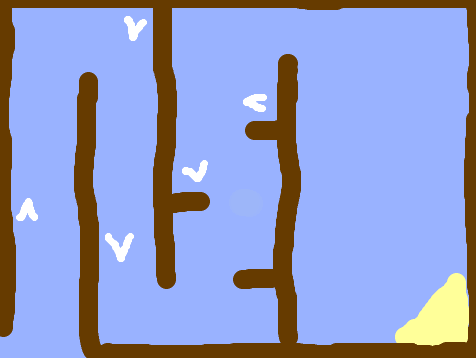
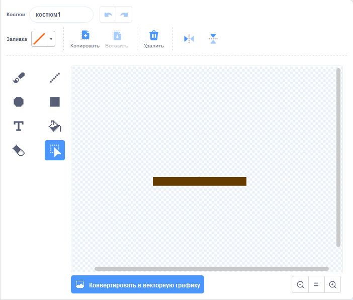

## Препятствия и ускорители

Прямо сейчас эта игра **ну очень** простая, давай добавим кое-что, чтобы сделать её более интересной.

Сначала ты добавишь несколько ускорителей, чтобы ускорить лодку.

--- task ---

Измени фон Сцены, добавив белые стрелки-ускорители.



--- /task ---

--- task ---

Теперь добавь дополнительные блоки кода в цикл `повторять всегда`{:class="block3control"} твоей лодки, чтобы спрайт лодки переместился на три дополнительных шага при касании белой стрелки.


```blocks3
if <touching color [#FFFFFF] ?> then
move (3) steps
end
```

--- /task ---

--- task ---

Протестируй свою игру, чтобы увидеть, какие новые стрелки ускоряют лодку.

--- /task ---

Затем ты добавишь вращающиеся ворота, которых лодка должна избегать.

--- task ---

Добавь новый спрайт, который выглядит следующим образом, и назови его «ворота»:


Убедись, что цвет спрайта ворот такой же, как цвет деревянных преград.


--- /task ---

--- task ---

Убедись, что центр спрайта ворот находится посередине.



--- /task ---

--- task ---

Добавь код для ворот, чтобы они всегда медленно вращались.

--- hints ---
 --- hint ---

Добавь блоки кода для спрайта ворот, чтобы они `поворачивались на 1 градус`{:class="block3motion"} `всегда`{:class="block3control"}.

--- /hint --- --- hint ---

Вот блоки кода, которые тебе нужны:


```blocks3
forever
end

turn cw (1) degrees

when flag clicked
```

--- /hint --- --- hint ---

Вот как должен выглядеть твой новый код:


```blocks3
when flag clicked
forever
turn cw (1) degrees
end
```

--- /hint ------ /hints ---

--- /task ---

--- task ---

Протестируй игру ещё раз. Теперь у тебя должны быть вращающиеся ворота, мимо которых нужно провести лодку.


--- /task ---