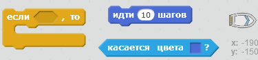
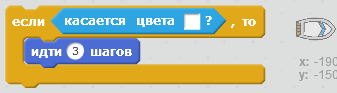
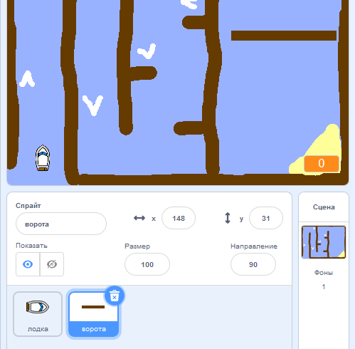
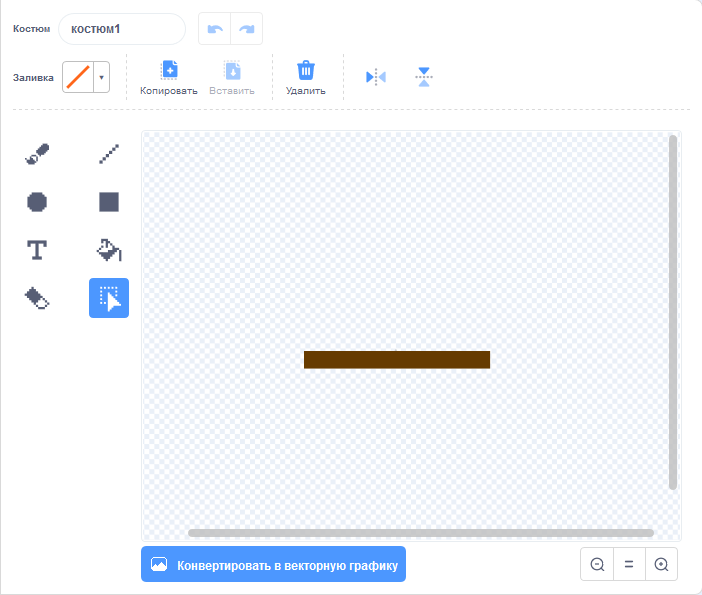
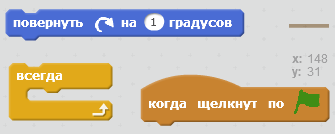
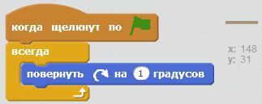
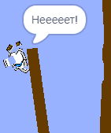

## Препятствия и бонусы

Прямо сейчас эта игра *ну очень* простая - давай добавим кое-что, чтобы сделать её более интересной.

\--- task \---

Для начала, давай добавим в твою игру немного «ускорителей». Измени фон твоей сцены: добавь несколько белых стрелок-ускорителей.

\--- /task \---

\--- task \---

Теперь добавь код для твоей лодки, в цикл "всегда", чтобы, при касании белого ускорителя лодка перемещалась на 3 шага.

\--- hints \--- \--- hint \--- `Если` твоя лодка `касается белого ускорителя`, то она `перемещается на 3 шага`.  
\--- /hint \--- \--- hint \--- Тебе понадобятся такие блоки кода:  \--- /hint \--- \--- hint \--- Твой код должен выглядеть как-то так:  \--- /hint \--- \--- /hints \---

\--- /task \---

\--- task \---

Ты также можешь добавить вращающиеся ворота, которых твоей лодке нужно избегать. Добавь новый спрайт под названием «ворота», он выглядит так:

Убедись, что цвет ворот такой же, как у деревянных барьеров.

\--- /task \---

\--- task \---

Установи центр спрайта ворот.

\--- /task \---

\--- task \---

Добавь код для ворот, чтобы заставить их всегда вращаться.

\--- hints \--- \--- hint \--- Добавь код для спрайта ворот, чтобы они `всегда` `поворачивались на 1 градус`. \--- /hint \--- \--- hint \--- Тебе понадобятся такие блоки кода:  \--- /hint \--- \--- hint \--- Твой код должен выглядеть как-то так:  \--- /hint \--- \--- /hints \---

\--- /task \---

\--- task \---

Проверь свою игру. Теперь у тебя должны быть вращающиеся ворота, которых тебе нужно избегать.

\--- /task \---