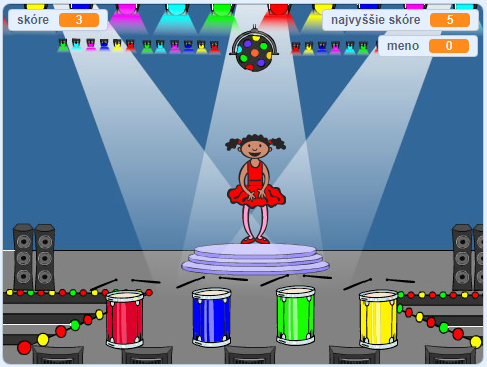

## Čo ďalej?

Gratulujeme k dokončeniu projektu Preteky lodí! Chcel/-a by si skúsiť niečo náročnejšie?

Môžeš skúsiť projekt [Pamäť](https://projects.raspberrypi.org/en/projects/memory?utm_source=pathway&utm_medium=whatnext&utm_campaign=projects).

\--- no-print \---

Začni kliknutím na zelenú vlajku. Sleduj postupnosť farieb tanečníčkiných šiat a počúvaj sprievodné bubnové rytmy, potom sa pokús zopakovať farby v rovnakom poradí klikaním na farebné bubny. Ak sa pomýliš v poradí farieb, je koniec hry!

  <iframe allowtransparency="true" width="485" height="402" src="//scratch.mit.edu/projects/embed/284452634/?autostart=false" frameborder="0" allowfullscreen scrolling="no" mark="crwd-mark"></iframe> 

\--- /no-print \---

\--- print-only \---

\--- /print-only \---