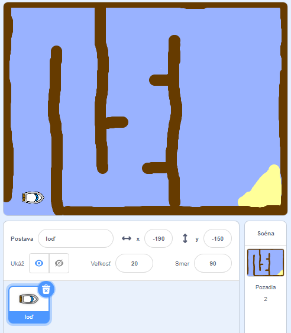

## Začíname

\--- task \--- Otvor štartovací projekt.

**Online:** otvor online štartovací projekt na [rpf.io/boat-race-starter-on](http://rpf.io/boat-race-starter-on){:target="_blank"} a klikni na **Remix**.

**Offline:** stiahni offline štartovací projekt z [rpf.io/p/en/boat-race-get](http://rpf.io/p/en/boat-race-get){:target="_blank"} a otvor ho použitím offline editoru.

Ak potrebuješ stiahnuť a nainštalovať offline Scratch editor, nájdeš ho na [rpf.io/scratchoff](http://rpf.io/scratchoff). \--- /task \---

\--- task \---

Projekt obsahuje obrázok lode a pretekársku dráhu ako pozadie s:

- Drevo, ktorému sa musí loď vyhnúť
- Púštny ostrov, na ktorý sa loď musí dostať
    
    

\--- /task \---