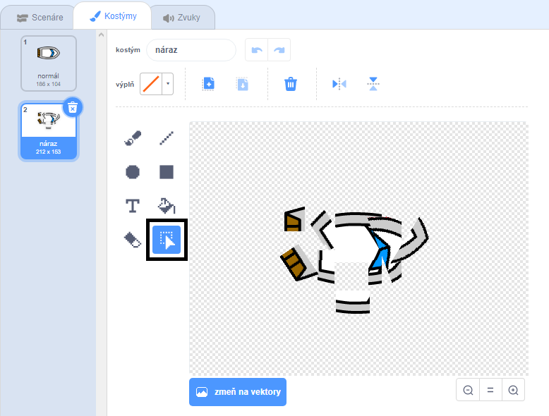
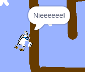

## Náraz!

V tejto chvíli dokáže loďka jednoducho preplávať cez drevené prekážky! Teraz to napravíš.

\--- task \---

Potrebuješ dva kostýmy pre loďku: jeden normálny a druhý, keď loďka narazí. Duplikuj kostým loďky a pomenuj jeden kostým ako 'normál' a druhý ako 'náraz'.

\--- /task \---

\--- task \---

Klikni na kostým 'náraz' a použi nástroj **Označ** na vybratie a uchopenie kúskov kostýmu. Uchopené kúsky kostýmu presuň a otoč tak, aby loďka vyzerala po náraze ako by sa rozbila na kusy.



\--- /task \---

\--- task \---

Teraz pridaj ku loďke scenár, ktorý spôsobí to, že loďka po dotyku s drevenými prekážkami narazí a rozpadne sa.

\--- hints \--- \--- hint \---

You need to add code blocks inside your `forever`{:class="block3control"} loop so that your code keeps checking if the boat sprite has crashed, and if it has crashed, the code needs to reset the boat sprite's position.

`if`{:class="block3control"} the boat is `touching`{:class="block3sensing"} the brown colour of the wood, you need to `switch to the hit costume`{:class="block3looks"}, `say Noooo! for 2 seconds`{:class="block3looks"}, and then `switch back to the normal costume`{:class="block3looks"}. Finally, you'll need to `point up`{:class="block3motion"} and `go to the start position`{:class="block3motion"}.

\--- /hint \--- \--- hint \---

Here are the code blocks you need:


```blocks3
ak <dotýkaš sa [ ] ?>
end

skoč na x: (-190) y: (-150)

zmeň kostým na (náraz v)

smerom (0)

zmeň kostým na (normál v)

bublina [Nieeeeee!] (2) s
```

\--- /hint \--- \--- hint \---

Here's what your code should look like:


```blocks3
pri kliknutí na ⚑
smerom (0)
skoč na x: (-190) y: (-150)
opakuj stále 
  ak <(vzdialenosť k (myš v)) > [5]> 
    smerom k (myš v)
    dopredu (1)
  end
  ak <dotýkaš sa [#663b00] ?> 
    zmeň kostým na (náraz v)
    bublina [Nieeeeee!] (2) s
    zmeň kostým na (normál v)
    smerom (0)
    skoč na x: (-190) y: (-150)
  end
end
```

\--- /hint \--- \--- /hints \---

\--- /task \---

\--- task \---

You should also add code to make sure that your boat sprite always starts out looking 'normal'.

Test your code again. If you try to sail the boat through a wooden barrier now, the boat should crash and then move back to its starting position.



\--- /task \---