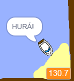

## Preteky na čas

Teraz pridáš do hry stopky, takže hráč sa bude snažiť dostať na ostrov čo najrýchlejšie.

\--- task \---

Do scenára pridaj novú premennú a nazvi ju `čas`{:class="block3variables"}.


[[[generic-scratch3-add-variable]]]

Zmenou spôsobu zobrazenia premennej na scéne si môžeš zvoliť, aký budú mať stopky vzhľad.

\--- /task \---

\--- task \---

Teraz pridaj do scenára bloky tak, aby sa stopky spustili, keď loďka odštartuje a zastavili, keď loďka pripláva ku ostrovu.

\--- hints \--- \--- hint \---

On the Stage, `when the green flag is clicked`{:class="block3control"}, `set the time to 0`{:class="block3variables"}. Inside your `forever`{:class="block3control"} loop, you'll need to first `wait 0.1 secs`{:class="block3control"}, then `change the time by 0.1`{:class="block3variables"}.

\--- /hint \--- \--- hint \---

Here are the code blocks you'll need:


```blocks3
zmeň [čas v] o (0.1)

pri kliknutí na ⚑

opakuj stále
end

čakaj (0.1) s

nastav [čas v] na [0]
```

\--- /hint \--- \--- hint \---

Here's what your new code should look like:


```blocks3
pri kliknutí na ⚑
nastav [čas v] na [0]
opakuj stále 
  čakaj (0.1) s
  zmeň [čas v] o (0.1)
end
```

\--- /hint \--- \--- /hints \---

\--- /task \---

\--- task \---

Test out your game and see how quickly you can get the boat to the island!



\--- /task \---