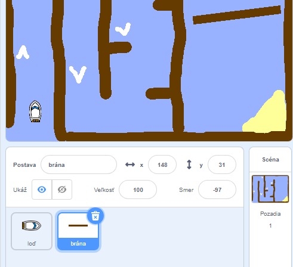
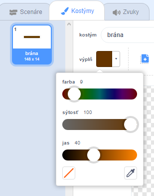
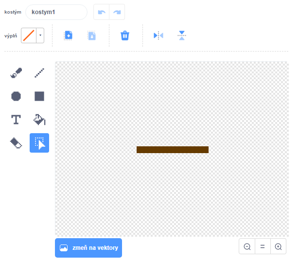
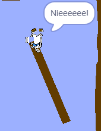

## Prekážky a vylepšenia

Teraz je hra **príliš** ľahká, takže pridajme niekoľko vecí, aby sme ju spravili zaujímavejšou.

Najskôr pridaj zrýchľovače, ktoré zvýšia rýchlosť loďky.

\--- task \---

Uprav pozadie scény tak, že doň pridáš niekoľko bielych šípok, ktoré budú slúžiť ako zrýchľovače.


\--- /task \---

\--- task \---

Do scenára loďky teraz pridaj bloky do cyklu `opakuj stále`{:class="block3control"} tak, aby sa loďka posunula o 3 kroky naviac, keď sa dotkne bielej šípky.


```blocks3
ak <dotýkaš sa [#FFFFFF] ?> 
  dopredu (3)
end
```

\--- /task \---

\--- task \---

Vyskúšaj si hru, aby si zistil/-a, či zrýchľovače zvyšujú rýchlosť loďky.

\--- /task \---

Teraz pridáš rotujúcu bránu, ktorej sa musí loďka vyhnúť.

\--- task \---

Pridaj novú postavu, ktorú nazveš 'brána' a bude vyzerať takto:



Uisti sa, že farba postavy brána je rovnaká, ako farba drevených prekážok.



\--- /task \---

\--- task \---

Uisti sa, že postava brána je umiestnená v strede medzi drevenými prekážkami.



\--- /task \---

\--- task \---

Do scenára postavy brány pridaj bloky tak, aby sa stále pomaly otáčala.

\--- hints \--- \--- hint \---

Pridaj bloky tak, že sa `opakuje stále`{:class="block3control"} otočenie brány `vpravo o 1 stupeň`{:class="block3motion"}.

\--- /hint \--- \--- hint \---

Tu sú bloky, ktoré budeš potrebovať do scenára:


```blocks3
opakuj stále
end

vpravo ↻ (1)

pri kliknutí na ⚑
```

\--- /hint \--- \--- hint \---

Takto by mal vyzerať tvoj scenár:


```blocks3
pri kliknutí na ⚑
opakuj stále 
  vpravo ↻ (1)
end
```

\--- /hint \--- \--- /hints \---

\--- /task \---

\--- task \---

Znovu si vyskúšaj hru. Teraz by si mal/-a na scéne vidieť otáčajúcu sa bránu okolo ktorej musí loďka preplávať.



\--- /task \---