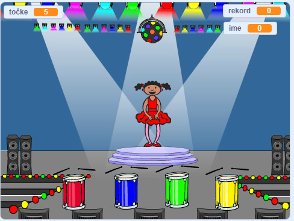

## Kaj sledi?

Čestitamo za uspešo izdelavo projekta 'Dirka s čolnom'! Ali bi rad ustvaril še kaj malo bolj zahtevnega?

Preizkusi projekt [Spomin](https://projects.raspberrypi.org/en/projects/memory?utm_source=pathway&utm_medium=whatnext&utm_campaign=projects).

\--- no-print \---

Za začetek klikni na zeleno zastavico. Oglej si zaporedje barv, ki jih prikazuje plesalkina obleka, in poslušaj spremljajoče ritme bobna, nato pa ponovi to zaporedje barv. Če se zmotiš, je igre konec!

  <iframe allowtransparency="true" width="485" height="402" src="//scratch.mit.edu/projects/embed/284452634/?autostart=false" frameborder="0" allowfullscreen scrolling="no" mark="crwd-mark"></iframe> 

\--- /no-print \---

\--- print-only \---

\--- /print-only \---