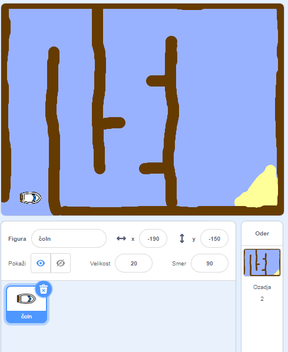

## Začetek

\--- task \---

Odprite začetni projekt.

## \--- collapse \---

title: Uporabljam spletno različico Scratcha

## image: images/image.png

Odprite projekt Čolnarjenje' na [jumpto.cc/boat-go](https://scratch.mit.edu/projects/63958014/#editor){:target="_blank"}. \--- /collapse \---

## \--- collapse \---

title: Uporabljam različico Scratcha brez povezave

## image: images/image.png

Prenesite projekt čolnarjenje iz [jumpto.cc/boat-get](http:jumpto.cc/boat-get){:target="_blank"} in ga odprite s pomočjo Scratcha brez povezave \--- /collapse \---

\--- /task \---

\--- task \---

Projekt vključuje figuro čolna in ozadje z:

- Ovirami, ki je jih bo moral čoln izogibati
- Puščavskim otokom, na katerega boste morali priti
    
    

\--- /task \---