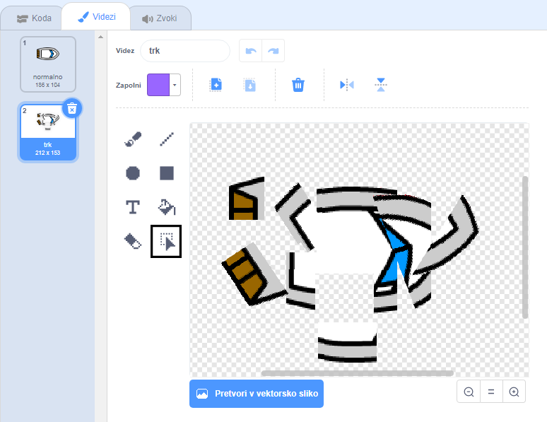
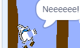

## Trčenje!

Trenutno lahko čoln preprosto pluje skozi lesene ograje! To boš popravil zdaj.

\--- task \---

Potrebujete dva kostuma za vaš čoln: enega običajnega kostuma in enega, ko se ladja zruši. Podvoji kostum vašega čolna in imenuj en kostum "normalno", drugi pa "zadeti".

\--- /task \---

\--- task \---

Kliknite na svoj 'kostum' in uporabite orodje **Izberi** da zgrabite kose kostumov in se premaknete in jih zavrtite, da bo čoln izgledal tako, kot da je padel na koščke.



\--- /task \---

\--- task \---

Sedaj dodajte kodo na vaš čoln, da se zruši in razpade, ko se dotakne rjave lesene pregrade.

\--- namigi \--- \--- namig \--- Dodajte kodne bloke znotraj zanke `vedno`{: class = "block3control"}, tako da vaša koda še naprej preverja, ali se je sprajnost ladje razbila in če se je strmoglavilo, mora koda ponastaviti položaj sprita čolna.

`če`{: class = "block3control"} čoln je `dotika`{: class = "block3sensing"} rjave barve lesa, morate `preiti na hit kostum`{: class = "block3looks"} , `reči Noooo! za 2 sekundi`{: class = "block3looks"}, nato pa `preklopi nazaj na običajen kostum`{: class = "block3looks"}. Končno boste morali `točko navzgor`{: class = "block3motion"} in `iti na začetno pozicijo`{: class = "block3motion"}.

\--- / namig \--- \--- namig \--- Tu so kodni bloki, ki jih potrebujete: 

```blocks3
če <touching color [ ] ?> nato
Konec

pojdi na X: (-190) y: (-150)

stikalo noša do (udaril v)

točko v smeri (0)

Stikalo noša na (normalnih V)

pravijo [Noooooo!] za (2) sekund
```

\--- / namig \--- \--- namig \--- Kakšna mora biti vaša koda: 

```blocks3
ko je zastavica kliknila
točko v smeri (0)
pojdite na x: (-190) y: (-150)
vedno
če <(razdalja do (kazalec miške v)) > [5]> in
proti (miška kazalec v)
kos (1) koraka
konec
ali <touching color [#663b00] ?> , nato
stikalo noša do (udaril v)
reči [Noooooo!] za (2) sekundami
stikalnega noša na (normalnih v)
točko v smeri (0)
pojdite na x: (-190) y: (-150)
konec
```

\--- / namig \--- \--- / namigi \---

\--- /task \---

\--- task \---

Dodati morate tudi kodo, da se prepričate, da se vaš čarovnik za čoln vedno začne iskati »normalno«.

Ponovno preizkusite svojo kodo. Če poskušate jadrnico zapeljati skozi leseno pregrado, bi se morala ladja zrušiti in se nato vrniti v izhodiščni položaj.



\--- /task \---