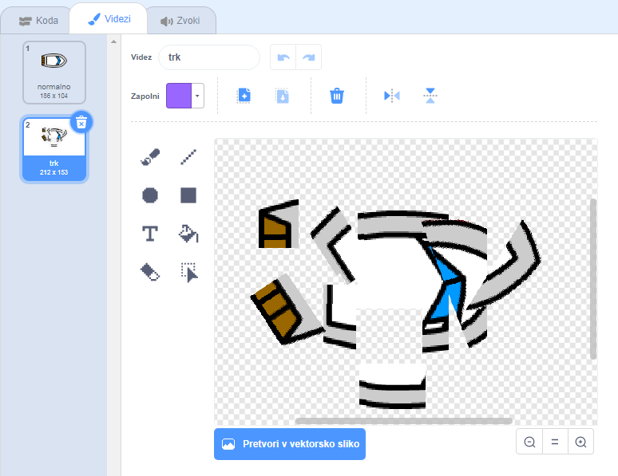

## Crash!

Trenutno lahko vaša ladja plove skozi lesene pregrade! To popravimo.

+ Boste potrebovali dve kostumi za vaš čoln, en normalni kostum, in ena za, ko bo plovilo zruši. Podvojite kostum čolna in poimenujte en kostum "normalno", drugi pa "hit".

+ Kliknite na kostum "hit" in izberite orodje Izberi, da zganite bitove čolna in jih premikate in vrtite okrog, da bi izgledali, kot da se je zrušil.
    
    

+ Zdaj dodajte kodo svojemu čolnu, da se zruši in razbije, ko se dotakne rjavih lesenih bitov.

\--- namige \--- \--- namig \--- v svojo `zanko za 123_6_1_321 morate dodati kodo, tako da vaša koda še naprej preverja, če se je ladja zrušila. <code>Če je` čoln `dotikajoč` rjavo barvo lesa, morate `preklopiti na kostum hit`, `reči Noooo! za 2 sekundi`in nato `preklopite nazaj na običajni kostum`. Končno, boste morali `točko gor` in `pojdite na začetni položaj`. \--- / namig \--- \--- nasvet \--- Tukaj so bloki kode, ki jih potrebujete:  \--- / hint \--- \--- nasvet \--- Tukaj je, kakšna naj bo vaša koda:  \--- / namig \--- \--- / namigi \---

+ Poskrbite tudi, da bo vaš čoln vedno začel iskati "normalno".
    
    Če poskušate zdaj pluti skozi leseno pregrado, morate videti, da se čoln zruši in se pomakne nazaj na začetek.
    
    