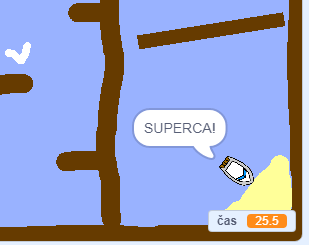

## Dodajanje časovnika

Zdaj boste v igro dodali časovnik, tako da bo igralec moral priti na otok čim prej.

\--- task \---

Dodajte novo spremenljivko `time`{: class = "block3variables"} na vašo stopnjo.


[[[generic-scratch3-add-variable]]]

Izberete lahko tudi pogled za svoj časovnik tako, da spremenite prikaz nove spremenljivke.

\--- /task \---

\--- task \---

Sedaj dodajte kodne bloke na vašo stopnjo, tako da časovnik odšteva, dokler ladja ne doseže otoka.

\--- namigi \--- \--- namig \--- Na stopnji `ko kliknete zeleno zastavo`{: class = "block3control"}, `nastavite čas na 0`{: class = "block3variables "}. Znotraj vaše `večno`{: class = "block3control"} zanke, boste morali najprej `čakati 0,1 sekund`{: class = "block3control"}, nato `spremeniti čas za 0,1`{: class = "block3variables" }. \--- / namig \--- \--- namig \--- Tu so kodni bloki, ki jih potrebujete: 

```blocks3
spremeni [time v] za (0.1)

ko je zastavica kliknila

vedno
konec

počakaj (0.1) sekund

nastavljen [čas v] na [0]
```

\--- / namig \--- \--- namig \--- Evo, kakšna naj bo vaša nova koda: 

```blocks3
ko je zastavica kliknila
nastavljena [čas v] na [0]
večno
počakaj (0.1) sekunde
spremeni [čas v] na (0.1)
konec
```

\--- / namig \--- \--- / namigi \---

\--- /task \---

\--- task \---

Preizkusite svojo igro in poglejte, kako hitro lahko dobite čoln na otok!



\--- /task \---